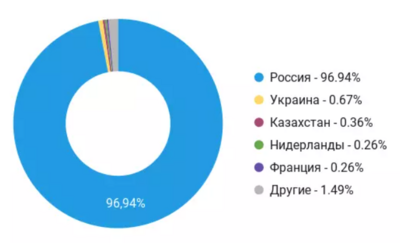
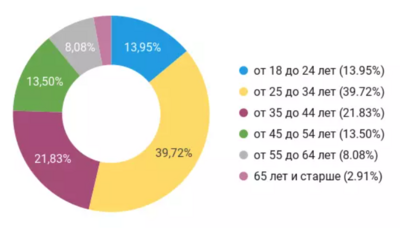

# Авито

## 1. Тема и целевая аудитория

Авито - сервис для размещения объявлений о товарах, недвижимости, вакансиях и резюме на рынке труда, а также услугах, занимающий первое место в мире среди сайтов объявлений.

### Функционал MVP

- создание объявлений (только товары)
- редактирование объявлений
- поддержка фото и видео в объявлении
- просмотр доски объявлений
- поиск товаров
- отзывы о продавце
- сохранение товара в "избранное"

### Аудитория

#### Количество

- 55 млн. пользователей в месяц (MAU)
- 11 мин./месяц в среднем проводит каждый пользователь на Авито
- 338 млн. посещений сайта avito.ru в месяц

#### Страны

#### Возраст

#### Пол

| Пол     | Процент |
|---------|---------|
| Мужчины | 56.79%  |
| Женщины | 43.21%  |

